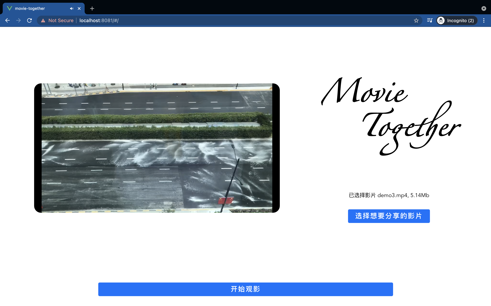

# Movie Together

_English | [简体中文](./README.md)_

## Overview

Based on the Agora Web SDK `agora-rtc-sdk-ng` and Vue component library `agora-rtc-vue`, this sample project shows how to implement a web app in which a user can share his/her local audio and video streams with remote users and make real-time interactions at the same time. This project is applicable to scenarios such as people watching a movie with friends and discussing the movie with them.

Another purpose of this project is to show the APIs and functions of `agora-rtc-vue`.

## Prerequisites

- A browser that matches the [supported browser list](https://docs.agora.io/en/Video/web_sdk_compatibility?platform=Web). Agora highly recommends using the latest version of Google Chrome.
- Physical audio and video input devices.
- Node.js and npm
- yarn

## Run the sample project

1. Navigate to `demo_movies_together` and run `yarn` to install dependencies.

2. Fill in `src/main.js` with the App ID and temp token generated in Agora Console.

   > - For how to get the App ID and generate a temp token, see [verifying user permissions](https://docs.agora.io/en/Agora%20Platform/token) to learn how to obtain App ID and Token. You can obtain a temporary token to quickly run the sample project.
   > - To improve the security of your project, Agora uses tokens (dynamic keys) to authenticate users joining the channel. The temporary token is for demonstration and testing purposes only. The channel name used to generate the token must be the same as the channel name used when joining the channel.

3. Run `yarn serve`.
4. Open the project `https://localhost:8080/` on your browser.
5. Click the `选择想要分享的影片` button to select the movie you want to share.
6. Click to the `开始观影` button to start watching this movie.
7. Share the URL of this movie to your friends.
8. Friends can open the URL and watch the movie. While watching the movie, you can interact with each other via audio or video.

## Q&A

   1. Q: When sharing a video on macOS Chrome, friends open the URL but only see green video.
      A: The green video is caused by a bug of macOS Chrome. You need to disable the Chrome hardware acceleration function, and re-share the URL to your friends.

   2. Q: I can not open the webpage.
      A: You need to trust the HTTPS certificate in the setting page in the browser and system.

## References

- [Agora.io official website](https://www.agora.io)
- [Web SDK documentation](https://docs.agora.io/en/Voice/API%20Reference/web_ng/index.html)
- [agora-rtc-vue documentation (Chinese)](https://webdemo.agora.io/agora_rtc_vue_doc/)

## Feedback

If you have any questions or suggestions, you can give feedback by issues.

## Disclaimer

The code of this project is used to show the APIs and related functions of Agora's products. It is not a complete project running in a complete local or online environment. It is used for translation and learning and must not be used for commercial purposes. Agora.io does not take responsibility for any losses and liabilities arising from any non-learning purposes of the project code.

When you use this project, please abide by the relevant local laws and regulations. Please confirm your right to use and disseminate the audio and video owners you use during use, and confirm the local laws and regulations governing broadcast and video content. You need to be fully responsible for the authenticity, legality, harmlessness, and functions of the audio and video content you use. Any legal responsibilities related to the use of video and audio are borne by you, and Agora.io does not assume any responsibility.

On the basis of this project following the GPL agreement, Agora.io reserves all rights to the code of this project.

## Resources

- You can read [the FAQ](https://docs.agora.io/en/faq) first.
- If you want to know more official examples, you can refer to [the official SDK examples](https://github.com/AgoraIO)
- If you want to understand the application of the Agora SDKs in complex scenarios, you can refer to [the official scenario case](https://github.com/AgoraIO-usecase)
- If you want to learn about some of the projects maintained by developers in the Agora community, you can check [the community](https://github.com/AgoraIO-Community)
- If you have a problem and need help from the developer, you can go to [the developer community](https://rtcdeveloper.com/) to ask questions
- If you need after-sales technical support, you can submit a ticket on [Agora Dashboard](https://dashboard.agora.io)
